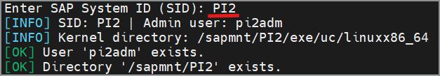
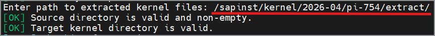
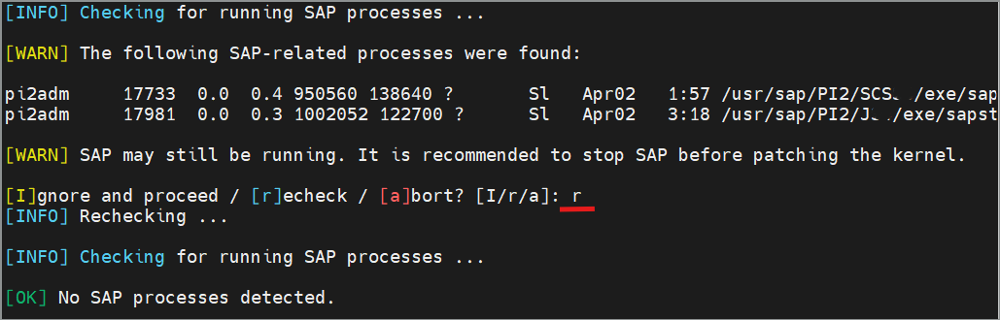
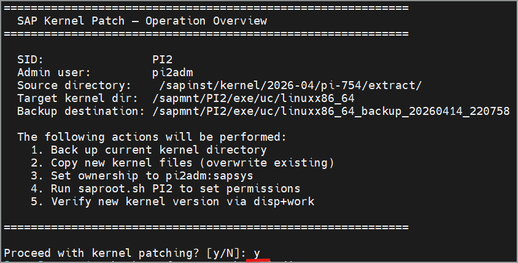
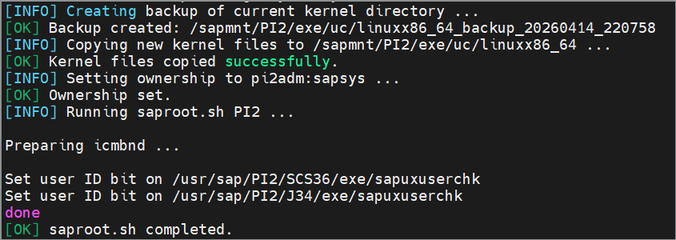
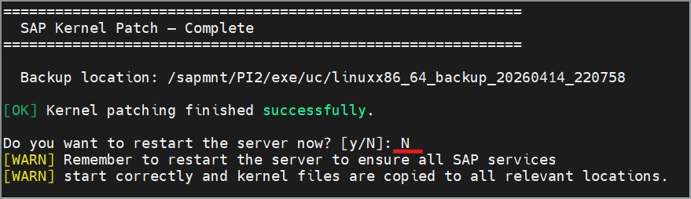

## Introduction
This is an interactive Linux shell script, that makes an SAP kernel patch process easier.

## Quick start
1. Download the script from the Releases section.
2. Upload it to your Linux/Unix server.
3. Set executable permissions for root.
4. Run the script: ./sap_kernel_patch.sh

## How it works
Prompts for an SID and checks if it is valid:

Prompts for a path with extracted kernel files:

Checks if there are runnging processes, and waits for you to stop them:

Displays a summary of collected data and lists the next steps:

Executes the steps:

After successful completion, asks you to restart the host:

